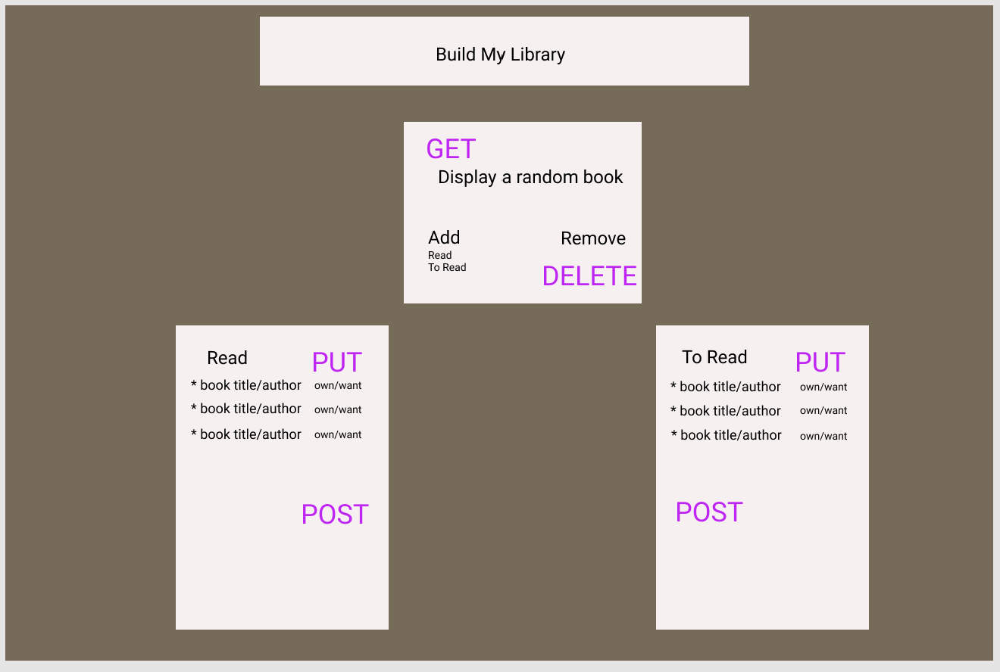
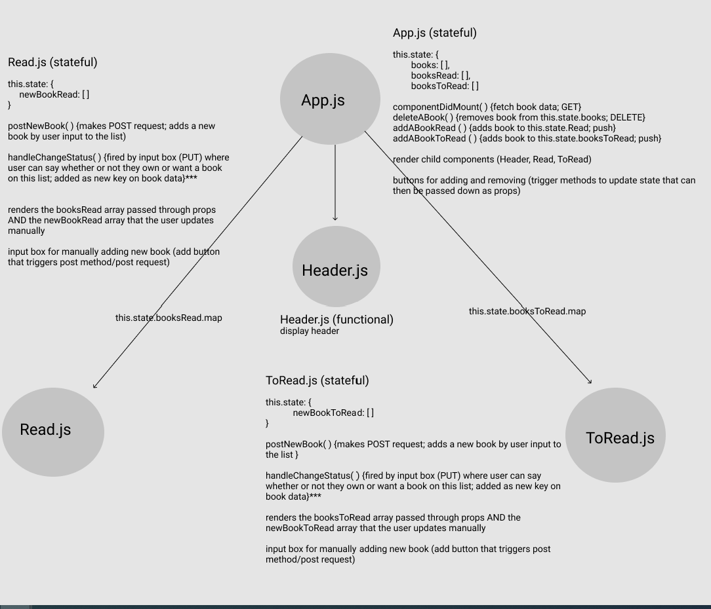

# No-DB Project

## Application Concept and Wireframe
### Application Concept
- This is a book sorting app
- I will utilize book data that I created
- Full CRUD
    - GET: get all books
    - POST: add books to Read or To Read lists
    - PUT: change the status of a book to own or want
    - DELETE: remove a book 

### Functionality
- There will be a header at the top of the page that displays the name of the app
- When the app loads, an image of a book will display below the header
    - Below the book information, there will be three buttons: 
        - Remove (for deleting the book)
        - Add 
            - Read (for adding the book to the Read list)
            - To Read (for adding the book to the To Read list)
    - Finally, below the book info and buttons will be two boxes- one labeled Read and one labeled To Read. This is where the sorted lists of books will display. 
        - Within each box, there will be two input options. One at the very bottom will allow users to add their own books to each list. 
        - The other input will be beside each book on the list and it will allow the user to update the status of each book to own or want. 

### Endpoints
- GET: fetch one random book from our book data array 
- DELETE: remove the currently displayed book; allow next book to appear
- PUT: change book status to own or want
- POST: add a new book to our array

### Component Architecture
- App.js: stateful; holds our book information as well as the sorting information the user selects.
    - this.state.books; this.state.booksRead; this.state.booksToRead
- Children: 
    - Header.js: functional
    - Read.js: stateful; receives book info (books, booksRead) as props; makes axios request for PUT and POST; renders the book information to display in the Read list
    - ToRead.js: stateful; receives book info (books, booksToRead) as props; makes axios requests for PUT and POST; renders the book information to display in the To Read list

### Wireframe

