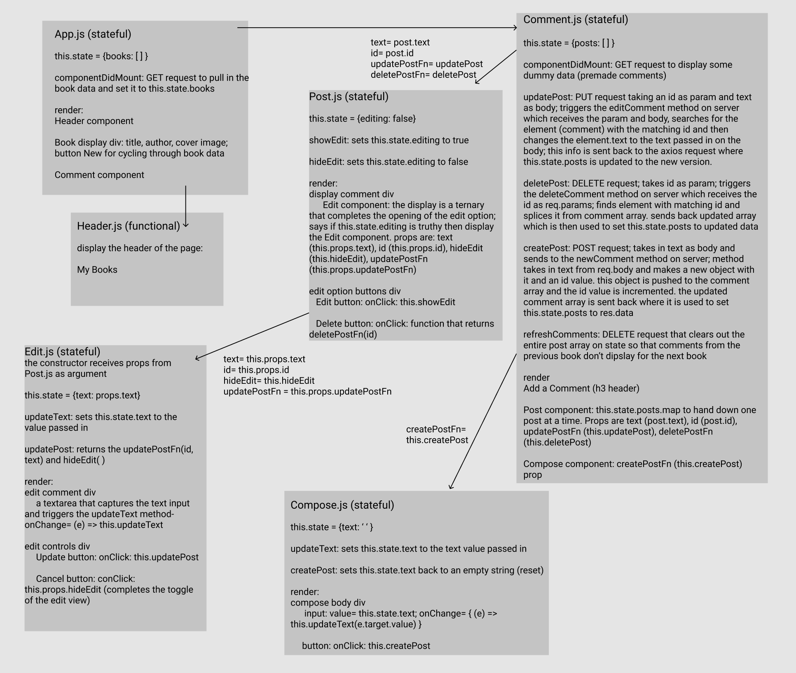

# No-DB Project

## Application Concept and Wireframe
### Application Concept
- This is a book review
- I will utilize book data that I created
- Full CRUD
    - GET: get all books
    - POST: make a comment about a book
    - PUT: change a comment about a book
    - DELETE: remove a comment about a book
    - DELETE: refresh all comments so comments about a new book can be made

### Functionality
- There will be a header at the top of the page that displays the name of the app
- When the app loads, an image of a book will display below the header.
- Below the the book information will be a button called new that allows you to get a new book to display.
- Next there is a section for adding comments:
    - There is a refresh button that will clear out comments from a previous book so that comments about the new book can be made.
    - Each comment is displayed in the order they are made.
        - Each comment has an edit or delete option below it:
            - The Edit button opens up the comment to be updated
            - The Delete button removes the comment

### Endpoints
- GET: fetch one random book from our book data array 
- DELETE: remove a comment
- DELETE: remove all previous comments 
- PUT: change a comment
- POST: add a new comment

### Component Architecture
- App.js: stateful
    - Holds and displays the book information; GET request
    - Renders the Header component and the Comment component
- Header.js: functional; child of App.js
- Comment.js: stateful; child of App.js 
    - Holds the comment information and methods for updating (PUT), creating (POST), and deleting (DELETE)
    - Renders the Post component and the Compose component
- Post.js: stateful; child of Comment.js
    - Holds the toggle information for the editing view
    - Renders the Edit component and the Edit and Delete buttons
- Compose.js; child of Comment.js
    - Holds the text input information
    - Renders the input and button for creating a comment
- Edit.js: stateful; child of Post.js
    - Holds

### Wireframe and Component Tree

